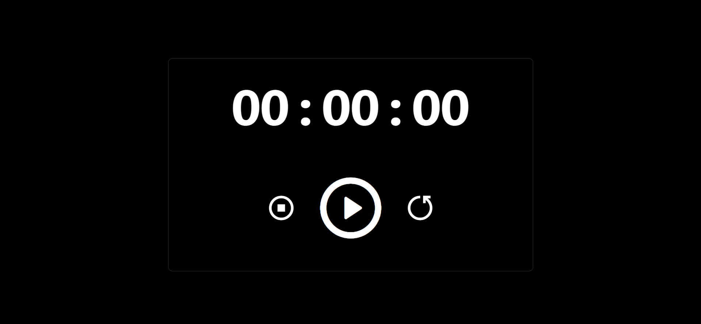

# Stopwatch Project



[](https://github.com/adityadhiman-in/notes_app_javascript/blob/main/LICENSE)
[](https://github.com/adityadhiman-in/notes_app_javascript/issues)
[](https://github.com/adityadhiman-in/notes_app_javascript/stargazers)
[](https://github.com/adityadhiman-in/notes_app_javascript/network)

## Overview

This project is a simple stopwatch built using HTML, CSS, and JavaScript. It allows users to start, stop, and reset a timer with a user-friendly interface.

## Features

- Start the stopwatch.
- Stop the stopwatch.
- Reset the stopwatch to zero.
- Displays hours, minutes, and seconds.

## File Structure

- `index.html`: The main HTML file for the stopwatch interface.
- `style.css`: The CSS file for styling the stopwatch.
- `script.js`: The JavaScript file for stopwatch functionality.

## Getting Started

1. **Clone the Repository**

   ```bash
   git clone https://github.com/adityadhiman-in/stopwatch.git
   cd your directory
   ```

2. Open the `index.html` file in your browser to see the project in action.

## Contact

Feel free to reach out if you have any questions or suggestions!

- [Website](https://adityadhiman.in)
- [GitHub](https://github.com/adityadhiman-in)
- [LinkedIn](https://www.linkedin.com/in/adityadhiman-in)

Made with ❤️ by [Aditya Dhiman](https://adityadhiman.in)
